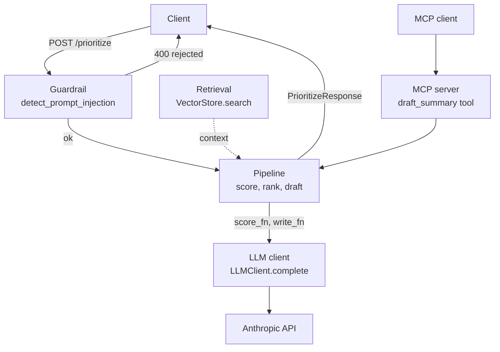

# coding-refresh

An 8-week, project-driven curriculum to resharpen coding skills for **AI engineering and agents**.
You build one agent (the capstone) across the course; each week adds a real capability.

- 📋 **Start here:** [CURRICULUM.md](CURRICULUM.md) — the week-by-week plan + progress checklist.
- 📚 **Reading:** [RESOURCES.md](RESOURCES.md) — curated, docs-first.
- 🗂 **Weeks:** [`week-01/`](week-01/README.md) … [`week-08/`](week-08/README.md)

## Setup (Week 1)

```bash
# Install uv if needed: https://docs.astral.sh/uv
uv sync                 # create venv + install dev deps (pytest, ruff)
cp .env.example .env    # add your API keys (Week 2+)

# Verify the toolchain
uv run ruff check .
uv run pytest
```

## Layout

```
coding-refresh/
├── CURRICULUM.md      # the plan + checklist
├── RESOURCES.md       # curated reading
├── pyproject.toml     # deps, ruff, pytest config
├── week-01/ … week-08/  # one folder per week, each with its own README
└── src/               # shared capstone code accumulates here (created as needed)
```

## Architecture

The capstone is a small FastAPI service that scores, ranks, and drafts a recommendation for a list
of input items (feedback, notes, etc.), guarded against prompt injection. Each block below was
built in the week noted.



| Block | Module | Week |
|---|---|---|
| FastAPI service + guardrail | [`week-08/app.py`](week-08/app.py) | 7 (guardrail), 8 (service) |
| Pipeline (score → rank → draft) | [`src/pipeline.py`](src/pipeline.py) | 6 |
| Retrieval / vector store | [`src/retrieval.py`](src/retrieval.py) | 5 |
| LLM client | [`src/llm_client.py`](src/llm_client.py) | 2 |
| MCP server (alt. entry point) | [`week-06/mcp_server.py`](week-06/mcp_server.py) | 6 |
| Structured extraction (ingest) | [`src/extract.py`](src/extract.py) | 3 |
| Agent loop (tool-use pattern) | [`src/agent_loop.py`](src/agent_loop.py) | 4 |
| Eval harness (offline, gates regressions) | [`src/evals.py`](src/evals.py) | 7 |

The hand-rolled agent loop (Week 4) is the tool-use pattern the curriculum teaches; the shipped
capstone uses the fixed `pipeline.py` workflow instead, since a workflow with fixed steps proved
more reliable and cheaper than a fully autonomous agent for this task.

## How to work each week

1. Read the week's `README.md` (objectives, resources, deliverable, self-check).
2. Build the deliverable. Commit it.
3. Confirm the self-check passes before moving on.
